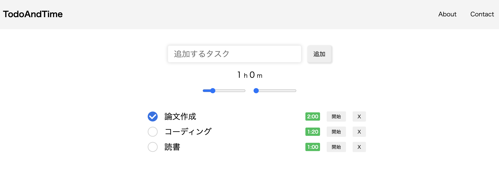

# TodoAndTime
「TodoAndTime」はタスクに所要時間を紐づけて、タイマーで時間を測りながら、タスクに取り組むことができるタスク管理アプリです。あらかじめ見積もった所要時間をタイマーで管理しつつ、集中してタスクに取り組むことで、より効率的にタスクを完了できます。
<br><br><br>

## 機能
- タスクに所要時間を紐づけて管理できます。
- タスクに取り組む際にタイマー機能を利用できます。
  
## 使い方
以下のコマンドでサーバを立ち上げてください。
```
npx http-server -p 3000
```
その後ブラウザで`localhost:3000`にアクセスしてください。

npxコマンドが使えない場合は、[Node.js](https://nodejs.org/ja)をインストールし、`npm install -g npx`でインストールしてください。

## Features
- Manage to-do tasks by linking the required time with each one.
- Time your task with a timer.

## How to use
Start the server like:
```
npx http-server -p 3000
```
and access to `localhost:3000`.

